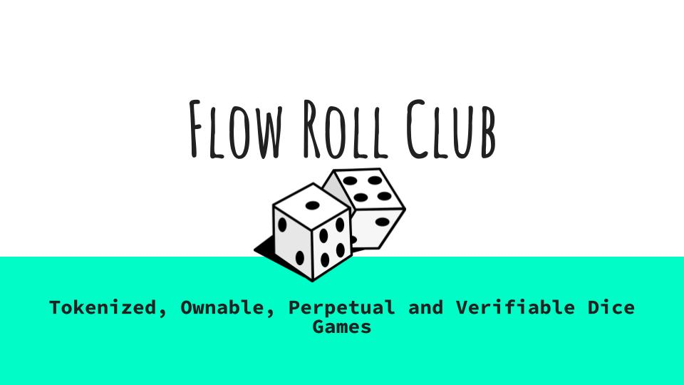

# Flow Roll Club

These are the smart contracts for Flow Roll Club, a gambling dice NFT project built exclusively for the Flow blockchain using Flow EVM. It uses Flow native VRF random number generation for a dice game which can be minted as an NFT. The owner of the Dice game (The NFT owner) will be able earn passive income from dice game players and the players can win a percentage from a prizeVault if they are able to guess the next number rolled accurately.

✅ On-Chain Gambling Is DeFi:
1. It is non-custodial (users control their funds via smart contracts).

2. It operates on decentralized infrastructure. Deployed on Flow Blockchain

3. The logic is enforced by public smart contracts, not a central operator.

4. Payouts are automatic and transparent.

5. Includes DeFi-like mechanics, token governance by NFT ownership.

### How it works?

The NFTs can be purchased using the NFTSale contract. The price of the NFTs are in Flow and can be set by the admin.

The admin can configure coupon codes for purchasing NFTs, which can allow a third party for earning commission from the NFT sales and it can be used for a marketing strategy.

The `NFTSale.sol` contract contains the buyNFT function which can accept a coupon code and the parameters of the NFT.

The NFT parameters contain the dice game parameters, including: 
1. ERC20 token used, 
2. What percentage of the prizePool is paid out to winners
3. How much does a dice roll cost?
4. How much percentage does the NFT holder earn?
5. The compensation for revealing the dice roll (dice rolls use a commit-reveal mechanism to avoid cheating and this is the reveal incentive) 
6. The dice min and max numbers (can be 1-6 or 1-12 etc.. it's a uint16)
7. The bet Type, which is encoded into a single uint16 number, passed together with min and max as betParameters

Then the NFT will be minted on successful payment.

The Admin can call setCoupon function to specify coupon parameters manually.

`FlowRollNFT.sol` contains the NFT smart contract, it's a generic OpenZeppelin ERC721 contract to be compatible with the standard. 

The NFT token count is capped at MAXMINT which is 1000 currently. The MAXMINT can't be increased.

The randomness is injected using the randProvider contract which can be found in `RandProvider.sol` and for tests mocked with `MockRandProvider.sol` It uses the CadenceArch native contract to request randomness and reveal randomness for a previous block.

The FLowRollNFT will mint the first NFT token in the constructor, then only the NFTSale.sol contract can mint more NFTs afterwards. Once the parameters for the game are specified they can't be changed.

The NFT contract also enforces that each game parameters can only exist once, so each NFT contract has to be different.

`PriceFeed.sol` and `MockPriceFeed.sol` implements a flow/usd price oracle using pyth.

`FlowRoll.sol` implements the Dice Game central to the Flow Roll Club. It's deployed when the NFT is minted.

The game is provably fair and completely verifiable and on-chain.

The Fees earned by the house in the Dice Game will be transferred to the owner of the ERC721 connected to the dice game.

`fundPrizePoolFLOW` and `fundPrizePoolERC20` functions are available to fund the dice game to get it started to incentivize players. 

`betFlow` and `betERC20` functions will allow a player to deposit and make a bet, `revealDiceRoll` function will allow anyone to reveal the result of the dice roll in the next blocks.
For security purposes the roll and the reveal can't be inside the same transaction. The revealCompensation is an incentive to earn a little income by helping the game chug along without a central server.

## Evaluating a win

When creating an NFT and deploying an new game, the betType must be specified together with the min and max values.
The betType encodes how the winner is evaluated.
If betType == 0, then the player must place a bet and guess exactly the winning number to get a reward
betType ==1 is invalid, you will understand why from the next point
betType == 2 ...N < Max, the winning number pulled is modulod with betType and compared to zero to check for winning number. This allows the creation of games where multiple dice rolls are winner, not just a single one. The player doesn't try to roll the bet, it tries to roll a predetermined winner number.

Example: Min =1; Max = 18; betType = 6; Then the winner numbers are: 6, 12, 18
Or other scenario: Min 1, Max = 2000, betType = 2, Then every even number between 1 and 2000 is a winner.

## Payouts and Fees

The payout and the fees on **WIN** are calculated as such:
e.g:
The dice roll cost is 1 FLOW
It is added to the prize pool on bet.

* With the prize pool at 100 FLOW,
* winner prize share of 10% (means winner will get 10% of the 100 Flow )
* a 0.01 reveal compensation
* 10% house edge (NFT owner profit, taken from the winner prize)
* There is a 5% protocol fee on the house edge, to sponsor website upkeep and further development

The payout to the winner is: 
8.99 FLOW
A payout to reveal the win is 0.01 FLOW
and the house earns 0.95 FLOW  with 0.05 FLOW protocol fee

The fees taken on **LOSS** are calculated as such:

The fee is taken from the *Dice Roll Cost only*, which was added to the prize pool when bet. 

With 1 FLOW as a dice roll cost,
10% of house edge and 0.01 reveal compensation:

The owner of the NFT receives 0.095 FLOW, the reveal compensation is 0.01 FLOW and 0.9 FLOW will stay in the prize pool for the next betters.

## User Experience

A user will be able to purchase Dice Roll Game NFTs to operate them and deposit the starting prize pool.
The NFT can be freely traded on any exchange and the prize pool deposit and the game activity both can influence it's price. It's an NFT with actual cash flow possibility.

For gamblers, they can select the Dice Roll Game with the best parameters and prize pool and call a Betting function.
After this the Bet is added to a list. A reveal transaction needs to be sent to get the results of the game and to transfer the payments out.

It provides an extra income for reveal transaction senders so gamblers can get a little extra money back. 

So players would be hunting for both the best prize pool and dice roll chances and for reveal transactions to earn a quick buck.

## The coupon system
The sale of the NFTs works with a coupon system that allows a third party advertiser to earn a commission while the user gets a certain percentage off the prize. 
The owner must manually set the coupon code and it's parameters. The coupons can be only used once per address. If no coupon code is provided, then the buyer must pay the full price.

Coupons will be pubished on social media for users to scoop up and get a good price on the NFTs and this is how incremental sale price is implemented.